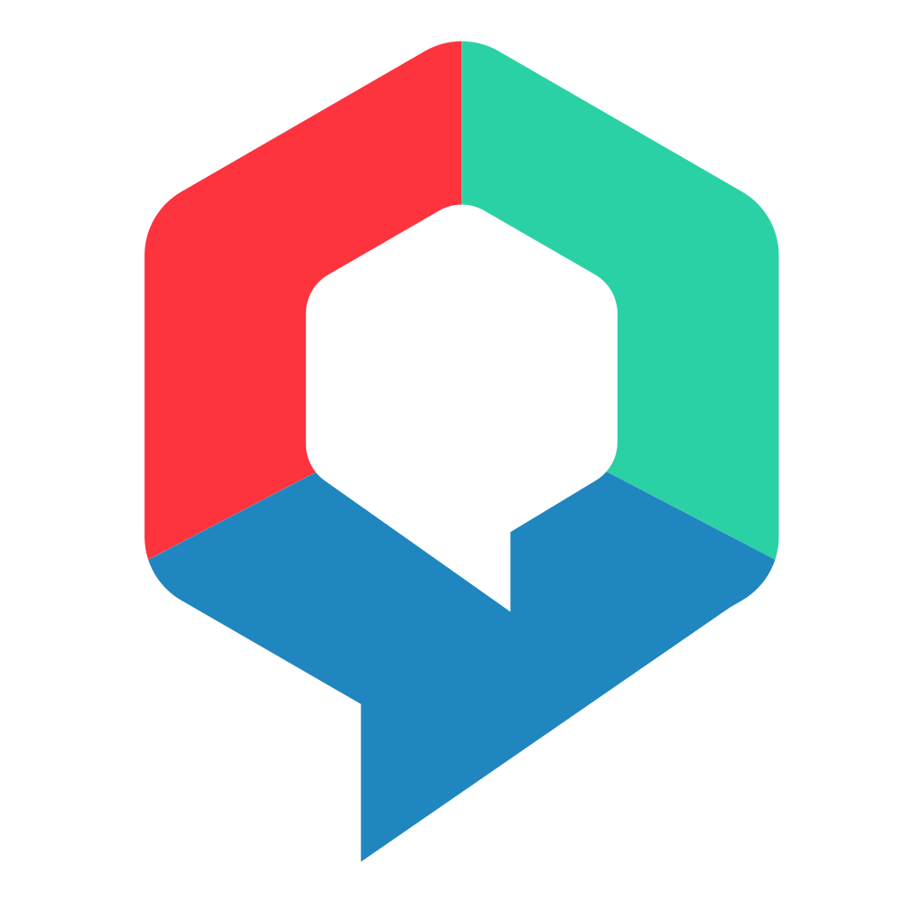

<!-- PROJECT LOGO -->
<br />
<div align="center">
  <a href="https://github.com/mibotchile/frontend-whatsapp">
    
  </a>

  <h3 align="center">OnbotGo - WhatsApp FrontEnd</h3>
</div>
### Built With

* [Angular 13](https://angular.io/)
* [Angular Material](https://material.angular.io/)
* [VEX 13 Template]((https://vex.visurel.com/)
  

<!-- GETTING STARTED -->
## Getting Started
  
### Prerequisites

* Node 16.10
* Angular CLI
  ```sh
  npm install -g @angular/cli
  ```
### Installation

1. Install project dependencies
   ```sh
   npm install
   ```
2. Run the project
   ```sh
   npm start
   ```

<p align="right">(<a href="#top">back to top</a>)</p>
